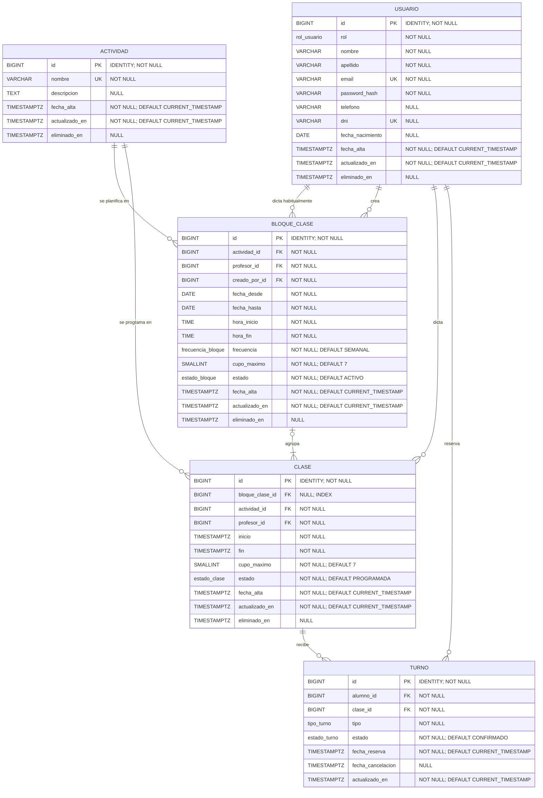

# Tecnicatura Universitaria en Programación a Distancia

## Trabajo Final Integrador

### 1. Datos generales

- **Proyecto:** Sistema de gestión de turnos para estudio de Pilates, Yoga y Sculpt
- **Integrantes:** Milano, Facundo Martín; Reinaudo, María Celeste; Ribero Mazzoni, Juan Pablo
- **Tutora:** María Candela Grosso
- **Grupo:** 125
- **Modalidad de origen:** Cliente real
- **Repositorio:** https://github.com/fmilano86/Administrador_Arizona

---

### 2. Problema y contexto

Los estudios de actividades como Pilates, Yoga y Sculpt suelen gestionar sus turnos de forma manual, por WhatsApp, planillas o cuadernos. Esto genera errores frecuentes: superposición de turnos para un mismo alumno, sobreventa de cupos (las clases tienen un límite físico de 7 personas por sala), y falta de visibilidad para el administrador sobre la ocupación real de cada clase y sobre datos básicos de sus alumnos, como por ejemplo cuándo cumplen años, para poder generar un vínculo más
cercano.

El proyecto propone una aplicación de gestión de turnos que digitalice este proceso, permitiendo a los alumnos reservar sus clases desde una app web o mobile, y al administrador visualizar y administrar la ocupación de cada actividad en tiempo real.

#### 2.1. Metodología de relevamiento y validación del problema

El relevamiento se realizó mediante entrevistas directas con la administradora del estudio (stakeholder principal), quien opera actualmente la gestión de turnos por
WhatsApp y planillas físicas. Se relevaron los siguientes actores y flujos:

- **Alumno:** reserva su turno por WhatsApp o de forma presencial, sin visibilidad de cupos disponibles en tiempo real.
- **Profesor:** recibe la lista de asistentes el mismo día de la clase, sin poder anticipar ausencias o cumpleaños.
- **Administrador:** concilia manualmente turnos, pagos y cupos, lo que genera errores de sobreventa y pérdida de información histórica de los alumnos.

La relevancia del problema fue validada directamente con la clienta, quien confirmó que la sobreventa de cupos y la pérdida de seguimiento de alumnos son los
inconvenientes que más tiempo administrativo le consumen semanalmente, lo que respalda la viabilidad y prioridad del proyecto propuesto.

Más allá de digitalizar el proceso existente, la propuesta busca agregar valor real mediante funcionalidades que hoy no existen en el flujo manual: validación automática de superposición de horarios, lista de espera con notificación automática al liberarse un cupo, y aviso de cumpleaños de alumnos para fortalecer el vínculo con el estudio — funcionalidades que un simple pasaje de WhatsApp a una planilla digital no resolvería.

---

### 3. Alcance y definición del MVP

El objetivo principal del MVP es resolver los problemas centrales identificados durante el relevamiento: **evitar la sobreventa de cupos, prevenir la superposición de reservas y centralizar la información de clases, alumnos y turnos**. Para esto, se priorizan las funcionalidades indispensables para que el sistema pueda ser utilizado por el estudio en su operación cotidiana.

#### 3.1. Funcionalidades que forman parte del MVP

##### Alumno

- Registro e inicio de sesión con dirección de correo electrónico y contraseña.
- Visualización de la grilla semanal de clases de Pilates, Yoga y Sculpt.
- Visualización de los cupos disponibles.
- Reserva de turnos.
- Validación automática para impedir que un alumno reserve dos actividades superpuestas.
- Visualización de sus propios turnos.
- Cancelación de sus propios turnos.

##### Profesor

- Inicio de sesión con dirección de correo electrónico y contraseña.
- Visualización de los turnos reservados para sus clases.
- Consulta de los datos de los alumnos inscriptos en sus clases.
- Filtrado de turnos por fecha y horario.

##### Administrador

- Inicio de sesión con dirección de correo electrónico y contraseña.
- Visualización de todos los turnos reservados.
- Filtrado de turnos por fecha y actividad.
- Alta y gestión de actividades.
- Gestión de los datos fundamentales de los alumnos: nombre, apellido, teléfono y fecha de nacimiento.
- Gestión de profesores:asignación y administración del acceso a funcionalidades.

##### Reglas de negocio fundamentales del MVP

- Cada clase tendrá un **cupo máximo de 7 personas**.
- El sistema impedirá realizar una reserva cuando la clase haya alcanzado su capacidad máxima.
- El sistema impedirá que un alumno tenga dos actividades superpuestas en el mismo horario.
- El sistema permitirá consultar la disponibilidad de cupos.
- El administrador podrá visualizar la ocupación de las actividades y gestionar la información necesaria para el funcionamiento del estudio.

---

#### 3.2. Funcionalidades que quedan como mejoras posteriores

Las siguientes funcionalidades forman parte de la visión futura del proyecto, pero no son indispensables para que el sistema cumpla su objetivo principal. Se incorporarán posteriormente, dependiendo del tiempo disponible y de la evolución del proyecto.

##### Lista de espera

Permitir que un alumno se registre en una lista de espera cuando una clase alcance su capacidad máxima y gestionar automáticamente la asignación de un cupo cuando se produzca una cancelación.

##### Notificaciones por email

Enviar avisos relacionados con la liberación de cupos, lista de espera u otros eventos relevantes.

##### Notificaciones push

Incorporar notificaciones push, especialmente orientadas a informar a los alumnos sobre disponibilidad de cupos y eventos relacionados con sus reservas.

##### Avisos de cumpleaños

Mostrar al profesor y/o administrador un aviso destacado cuando un alumno cumpla años, con el objetivo de fortalecer el vínculo entre el estudio y sus alumnos.

##### Pagos

Incorporar la posibilidad de que los alumnos abonen la cuota mediante un enlace a una billetera virtual u otro medio de pago.

##### Avisos de vencimiento

Notificar al alumno cuando se aproxime el vencimiento de su cuota.

##### Facturación

Incorporar funcionalidades para la visualización y gestión de facturación.

##### Aplicación mobile

La aplicación mobile forma parte de la visión del proyecto. Su incorporación se evaluará de acuerdo con el avance del MVP y el tiempo disponible. En caso de priorizarse, se buscará mantener el código y las validaciones compartidas con la aplicación web.

---

#### 3.3. Funcionalidades fuera del alcance

Para mantener un alcance realista y acorde con los objetivos del Trabajo Final Integrador, quedan fuera del alcance:

- Gestión de múltiples sucursales o estudios.
- Gestión contable avanzada.
- Integración con sistemas externos de facturación no contemplados en el proyecto.
- Procesamiento automático de pagos que requiera una integración compleja con terceros.
- Funcionalidades que no estén directamente relacionadas con la gestión de clases, alumnos, profesores y reservas.

Las funcionalidades futuras podrán ser reevaluadas una vez finalizado el MVP.

---

### 4. Roles y permisos dentro del MVP

El sistema contempla tres roles principales: **Alumno, Profesor y Administrador**.

| Funcionalidad               | Alumno | Profesor | Administrador |
| --------------------------- | :----: | :------: | :-----------: |
| Registrarse                 |   ✓    |    X     |       X       |
| Iniciar sesión              |   ✓    |    ✓     |       ✓       |
| Ver clases y cupos          |   ✓    |    X     |       X       |
| Reservar una clase          |   ✓    |    X     |       X       |
| Cancelar una reserva propia |   ✓    |    X     |       X       |
| Ver sus propias reservas    |   ✓    |    X     |       X       |
| Ver turnos de sus clases    |   X    |    ✓     |       ✓       |
| Filtrar turnos              |   X    |    ✓     |       ✓       |
| Ver alumnos inscriptos      |   X    |    ✓     |       ✓       |
| Gestionar actividades       |   X    |    X     |       ✓       |
| Gestionar horarios          |   X    |    X     |       ✓       |
| Gestionar alumnos           |   X    |    X     |       ✓       |
| Gestionar profesores        |   X    |    X     |       ✓       |
| Gestionar accesos/roles     |   X    |    X     |       ✓       |
| Controlar cupos y ocupación |   X    | Consulta |       ✓       |

---

### 5. Plan de trabajo y stack tecnológico

- **Frontend Web:** React + TypeScript (Vite)
- **Frontend Mobile:** React Native con Expo + TypeScript
- **Backend:** Python + FastAPI (API REST), autenticación JWT
- **Base de datos:** PostgreSQL, vía SQLAlchemy (ORM)
- **Código compartido:** paquete TypeScript compartido (tipos y validaciones) entre web y mobile, en un monorepo pnpm

#### 5.1 Notificaciones

- Email mediante SMTP.
- Push mediante Expo Notifications.

Estas funcionalidades de notificación se consideran parte de las mejoras posteriores y no son indispensables para el funcionamiento inicial del MVP.

#### 5.2 Despliegue

- **Frontend Web:** Vercel/Netlify
- **Backend:** Render/Railway
- **Base de datos:** Supabase o similar

#### 5.3 Control de versiones

Repositorio único en GitHub, con una estructura prevista similar a:

```text
├── backend/
├── apps/
│   ├── web/
│   └── mobile/
├── packages/
│   └── shared/
└── README.md
```

---

### 6. Justificación tecnológica

La selección del stack se basó en los siguientes criterios:

#### 6.1 Escala y madurez del problema

Al tratarse de un sistema de uso acotado (un solo estudio, decenas de alumnos concurrentes) no se justifica una arquitectura distribuida ni bases de datos NoSQL. Se optó por PostgreSQL por sobre alternativas no relacionales debido a la naturaleza fuertemente relacional del dominio (alumnos, turnos, horarios y pagos con relaciones e
integridad referencial claras), y porque las consultas de disponibilidad de cupos y validación de superposición requieren transacciones consistentes, algo que un modelo no relacional dificultaría.

#### 6.2 Costo de aprendizaje vs. tiempo de desarrollo

El equipo ya cuenta con experiencia previa en React, Python y bases de datos relacionales, lo que reduce la curva de aprendizaje y permite dedicar más tiempo al desarrollo funcional que a la adopción de tecnologías nuevas.

#### 6.3 Entorno de despliegue

Se priorizaron plataformas PaaS (Vercel/Netlify) por sobre la administración de servidores propios o contenedores, dado que el equipo no cuenta con experiencia en DevOps avanzado y estas plataformas permiten desplegar y escalar con configuración mínima, acorde a los plazos del cuatrimestre.

#### 6.4 Riesgo de cambio de tecnología

Al ser un stack estándar y ampliamente documentado (React, FastAPI, PostgreSQL), se minimiza el riesgo de tener que migrar tecnologías en etapas avanzadas del proyecto, evitando así reescrituras que comprometan el cronograma.

---

### 7. Estado de avance

Al momento de la primera entrega se cuenta con:

- Idea del proyecto definida.
- Problemática identificada y validada.
- Stakeholder principal identificado.
- Entrevistas realizadas con la administradora del estudio.
- Actores y flujos principales relevados.
- Stack tecnológico definido.
- Equipo de desarrolladores formado.
- Alcance del MVP definido y priorizado.

### 8. Modelo de datos

El sistema utiliza un modelo de datos relacional compuesto por las entidades
Usuario, Actividad, Bloque de clase, Clase y Turno.

La entidad Bloque de clase permite generar y administrar conjuntamente varias
clases relacionadas. Cada clase representa un encuentro concreto y puede
pertenecer a un bloque o haber sido creada individualmente.

#### 8.1. Diagrama Entidad-Relación



#### 8.2. Descripción de las entidades

| Entidad       | Descripción                                                        |
| ------------- | ------------------------------------------------------------------ |
| `Usuario`     | Almacena los datos de alumnos, profesores y administradores.       |
| `Actividad`   | Representa las disciplinas ofrecidas por el establecimiento.       |
| `BloqueClase` | Contiene la configuración común de un conjunto de clases.          |
| `Clase`       | Representa una clase concreta en una fecha y horario determinados. |
| `Turno`       | Registra la reserva de un alumno para una clase.                   |

#### 8.3. Relaciones principales

- Una actividad puede utilizarse en numerosos bloques y clases.
- Un profesor puede estar asignado a múltiples bloques y clases.
- Un bloque agrupa una o más clases.
- Una clase puede pertenecer a un bloque o crearse individualmente.
- Un alumno puede reservar múltiples turnos.
- Cada turno corresponde a una única clase y a un único alumno.

#### 8.4. Reglas de integridad

- El correo electrónico de cada usuario debe ser único.
- Una clase debe tener una actividad y un profesor.
- La fecha y hora de finalización deben ser posteriores al inicio.
- El cupo máximo debe ser mayor que cero.
- Un alumno no puede reservar dos veces la misma clase.
- La cantidad de turnos confirmados no puede superar el cupo máximo.
- Las clases individuales tienen `bloque_clase_id = NULL`.
