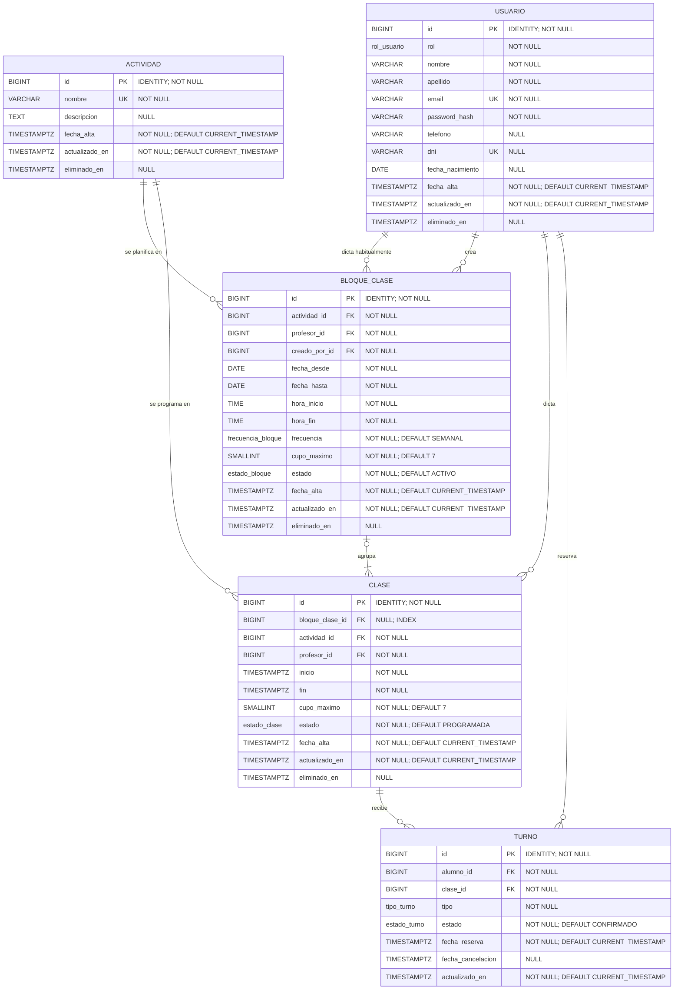

### Modelo de datos

El sistema utiliza un modelo de datos relacional compuesto por las entidades
Usuario, Actividad, Bloque de clase, Clase y Turno.

La entidad Bloque de clase permite generar y administrar conjuntamente varias
clases relacionadas. Cada clase representa un encuentro concreto y puede
pertenecer a un bloque o haber sido creada individualmente.

#### Diagrama Entidad-Relación

#### Descripción de las entidades

| Entidad       | Descripción                                                        |
| ------------- | ------------------------------------------------------------------ |
| `Usuario`     | Almacena los datos de alumnos, profesores y administradores.       |
| `Actividad`   | Representa las disciplinas ofrecidas por el establecimiento.       |
| `BloqueClase` | Contiene la configuración común de un conjunto de clases.          |
| `Clase`       | Representa una clase concreta en una fecha y horario determinados. |
| `Turno`       | Registra la reserva de un alumno para una clase.                   |

#### Relaciones principales

- Una actividad puede utilizarse en numerosos bloques y clases.
- Un profesor puede estar asignado a múltiples bloques y clases.
- Un bloque agrupa una o más clases.
- Una clase puede pertenecer a un bloque o crearse individualmente.
- Un alumno puede reservar múltiples turnos.
- Cada turno corresponde a una única clase y a un único alumno.

#### Reglas de integridad

- El correo electrónico de cada usuario debe ser único.
- El DNI de cada usuario, cuando se encuentre informado, debe ser único.
- El nombre de cada actividad debe ser único.
- Una clase debe tener asociada una actividad y un profesor existentes.
- El usuario asignado como profesor debe tener el rol `PROFESOR`.
- La fecha y hora de finalización de una clase deben ser posteriores a su inicio.
- El cupo máximo de una clase debe ser mayor que cero.
- Una clase puede pertenecer como máximo a un bloque.
- Las clases creadas individualmente deben tener `bloque_clase_id = NULL`.
- La fecha de finalización de un bloque debe ser igual o posterior a su fecha de inicio.
- La hora de finalización de un bloque debe ser posterior a su hora de inicio.
- Un turno debe estar asociado a un alumno y a una clase existentes.
- El usuario asociado a un turno debe tener el rol `ALUMNO`.
- Un alumno no puede reservar dos veces la misma clase.
- La cantidad de turnos con estado `CONFIRMADO` no puede superar el cupo máximo de la clase.
- No pueden registrarse turnos para clases canceladas o eliminadas.
- Cuando un turno se encuentre cancelado, debe registrarse su fecha de cancelación.

#### Índices

Con el objetivo de optimizar las consultas más frecuentes del sistema, se
definieron los siguientes índices:

| Índice | Tabla | Campos | Tipo | Finalidad |
|---|---|---|---|---|
| `idx_clase_inicio` | `clase` | `inicio` | Simple | Consultar clases por fecha o período. |
| `idx_clase_actividad_inicio` | `clase` | `actividad_id`, `inicio` | Compuesto | Filtrar clases por actividad y fecha. |
| `idx_clase_profesor_inicio` | `clase` | `profesor_id`, `inicio` | Compuesto | Consultar la agenda del profesor y detectar superposiciones. |
| `idx_clase_bloque` | `clase` | `bloque_clase_id` | Simple | Modificar o cancelar las clases pertenecientes a un bloque. |
| `idx_turno_clase_estado` | `turno` | `clase_id`, `estado` | Compuesto | Obtener los turnos confirmados y controlar el cupo. |
| `idx_turno_alumno_estado` | `turno` | `alumno_id`, `estado` | Compuesto | Consultar los turnos de un alumno según su estado. |
| `idx_turno_fecha_reserva` | `turno` | `fecha_reserva` | Simple | Consultar y contabilizar reservas por período. |

---
